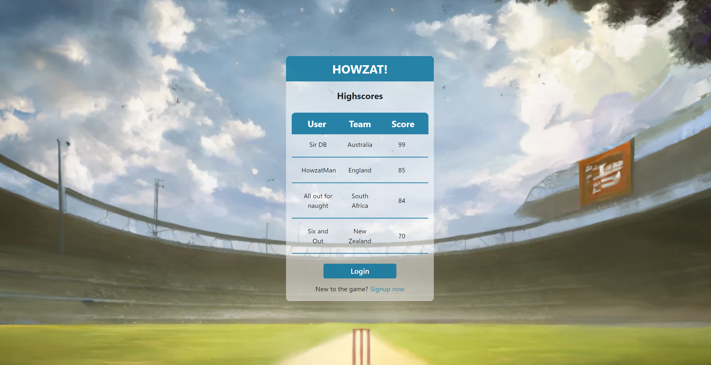

# Project 3 - React Howzat Cricket

## Description

Howzat gives users the full cricket experience in which they choose their own personal strategy in order to see how they stack up against the world’s best players. No two games of Howzat are the same, but they all are sure to bring you fun and competition (edited) 

## Table of Contents 

* [Installation](#installation-instructions)

* [Usage](#usage-information)

* [License](#license)

* [Contributing](#contributing-guidelines)

* [Tests](#test-instructions)

* [Questions](#questions)

## Installation Instructions

Please follow these steps when running this application.   1. git clone the repository to your local machine.  2. In terminal, CD into the applications folder.  3. Type and enter 'npm install' to install the dependencies.  4. Type and enter 'npm run build' to build the application.  6. The build will be available in your client folder.

## Usage Information

As a user:
I want a fun game to satisfy my love for cricket
I want a game where I can compare my scores with friends
I want a game that looks pretty

Sample:

.PNG)
.PNG)

.png)
.png)

## License

MIT: Permissive free license software. Please visit https://opensource.org/licenses/MIT for more information.
  
## Contributing Guidelines

timmobrien and Flipper5001 were the sole contributers for this project. If you wish to make any contributions, please refer to the questions section for our contact information.

## Questions

Other works can be found on https://github.com/Flipper5001.

If you have any questions or queries, please contact the following email address and we will get back to you as soon as possible.  
placeholder@gmail.com

## Link to site
https://howzat-cricket.herokuapp.com/